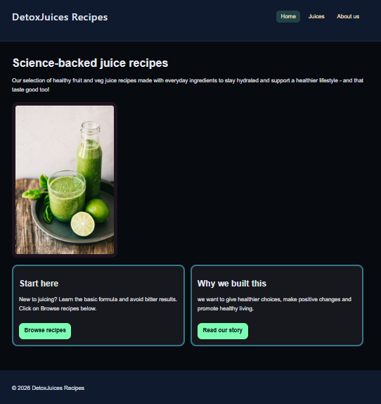
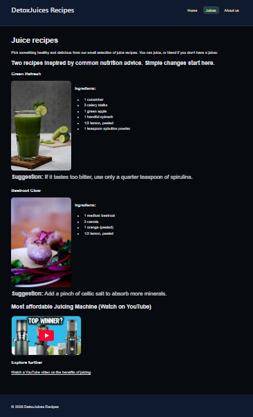
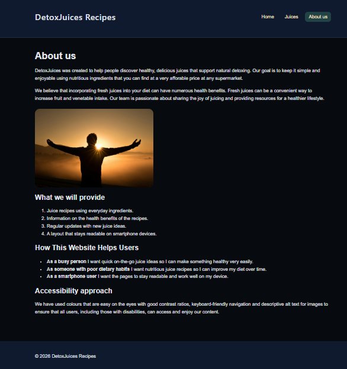
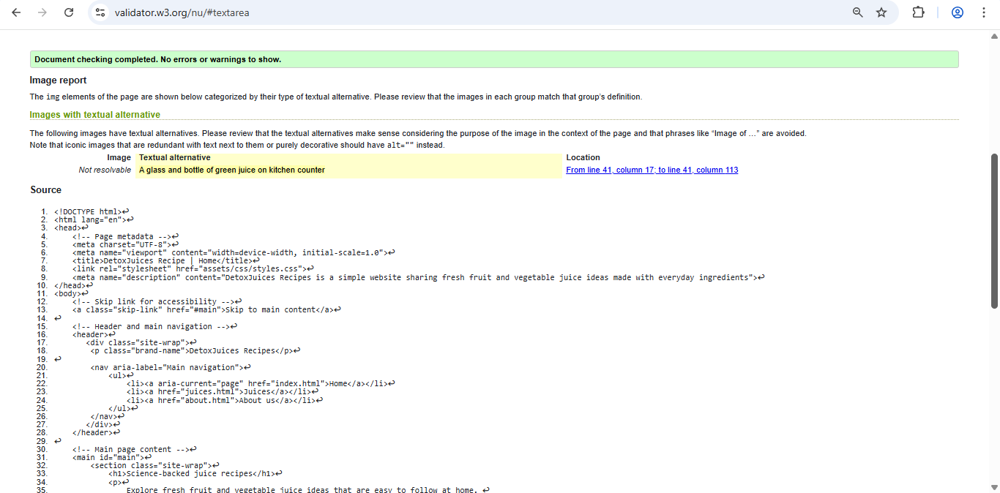
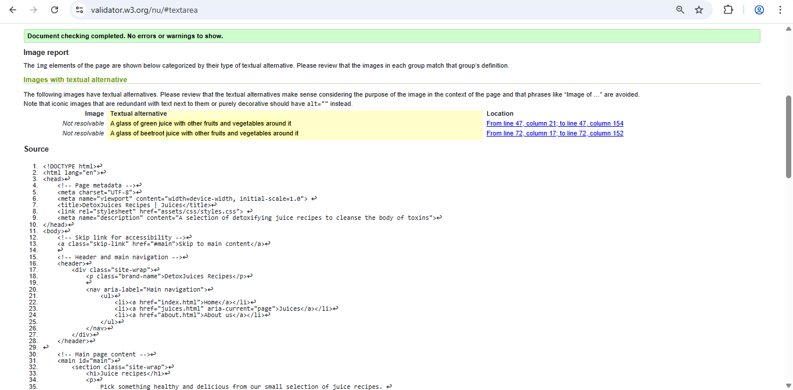
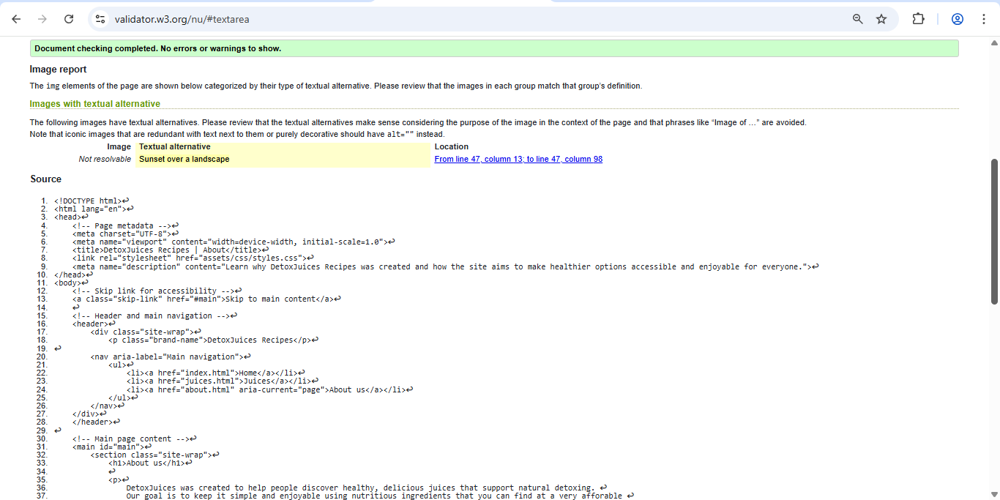
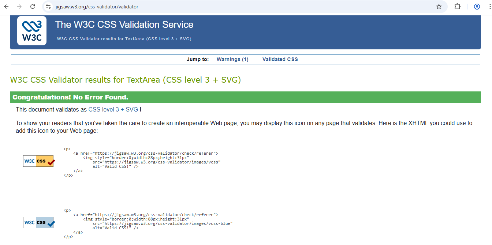

# DetoxJuices Recipes (Front-end Website)

## Project overview
DetoxJuices Recipes is a static front-end website built using HTML5 and CSS3. The website provides simple fruit and vegetable juice recipes using everyday ingredients. Primarily focusing on just two unique recipes.
The aim of this project is to encourage healthier habits by making the recipes easy to understand, visually clear and accessible across different devices.

## Project rationale 
The idea behind this prject was to create a website for users who want healthier drink ideas in a format that feels simple and approachable. There are recipe websites that can feel too crowded or contain too much information all at once. Due to this reason, I took the initiative of building a much more smaller website that focuses on clarity, readability, and ease of use. The project is aimed at beginners, busy users and for people who are accessing the website on mobile devices. The design choices were made around those needs. Ultimately keeping the page structure simple, used consistent navigation across all pages and limiting the amount of content on each page so the information would be easier to follow.

## Purpose and value
The purpose of this website is to help people who want to improve their diet and not feel overwhelmed by complex recipes. 
The website provides value by keeping juice recipes simple, affordable, and easy to follow, using ingredients that are widely available. By focusing on a small number of clear recipes, the site encourages users to build healthy habits gradually rather than offering too many choices at once.

The goal is to provide a practical and accessible resource that works well on both desktop and mobile devices, making healthy choices easier to fit into everyday life.

## Target audience
The target audience consists of:
- People who are searching for simple sustainable healthy habits
- People who are new to making juices and want easy affordable ingredients
- Smartphone users accessing the site who want easy readable pages. Especially for those who can only use basic funtions on their device

## User stories
- As a beginner, I want effortless juice recipes allowing me to start easily
- As a busy person, I want quick and healthy juice ideas that fit into my routine
- As a mobile user, I want the website to stay readable and easy to use on my device

## Website pages
The website consists of three pages:
- index.html - home page introducing the website and directing users to the recipes and about page
- juices.html - it is a recipes page containing two juice recipes and an embedded video
- about.html - background information about the project, target users, and accessibility approach

## Accessibility
- Using semantic HTML elements 'header', 'nav', 'sections', 'main', 'article' and 'footer'
- Includes skip link for keyboard users and screen reader users
- No autoplay media, users can control video playback
- Clear focused navigation and hover states for navigation links
- Sufficient contrast between text and background colours
- Descriptive alt text for images

## Screenshots linked to user stories

### User story 1: beginner-friendly recipes
The home page introduces the purpose of the site clearly and gives users a direct route to the recipe page.

### User story 2: quick and simple recipe access
The juices page presents ingredients in a clear format so users can read and follow recipes easily.

### User story 3: understanding the purpose of the website
The about page explains the purpose of the website and how it is intended to help its users.

## Technologies used
- HTML5
- CSS3
- Visual Studio Code
- GitHub (manual commits for version control)
- CSS Grid and media queries for user layout

## Development lifecycle

### Planning
The project began with the idea of creating a simple front-end website based on healthy juice recipes. I identified the main audience as beginners, busy users, and mobile users. From there, I planned a three-page structure that would stay focused and easy to navigate.

### Structure
The HTML pages were built first using semantic elements so the layout would be organised and accessible. Navigation was added early so that all pages would stay connected consistently.

### Styling 
The CSS was then added to create a dark theme, readable text, card-style sections, and spacing that kept the pages clear. Media queries were used to improve the layout on smaller devices.

### Testing and improvment 
After the main structure and styling were complete, the site was tested manually for navigation, readability, responsiveness, accessibility features and media behaviour. Some content wording, code organisation and folder structure on both VS code and GitHub needed to be improved to make the final version clearer.

## Reflection on the development process
During development, the main focus of the project was to keep the website simple, readable and beginner-friendly. One challenge was balancing visual design with accessibility and usability. An example for this is , the dark colour scheme needed to maintain enough contrast so that text remained easy to read. Another improvement made during development was reorganising the HTML and CSS files into clearly commented sections.This made the code easier to understand and maintain.

## Validation

### Validation evidence 
Each HTML page was checked using the W3C Markup Validation Service and the CSS file was checked using the W3C Jigsaw Validation service.

### HTML validation 

### CSS validation

## Attribution 
All HTML and CSS code in this project was written by the author. Videos on the website are hosted on YouTube and embedded. No external frameworks, libraries or templates were used in the development of this project.

